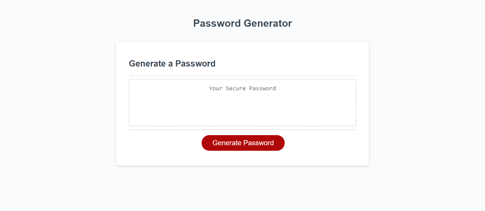

# Password Generator

## Javascript - Module 3

This assignment had us create a password generator and features dynamically updated HTML and CSS powered by JavaScript code.  

This involved collecting information from the user, testing to make sure that what they input matched the criteria that was required. Prompting the user when a mistake was made to input the correct information and then generating a random password.  

Link to Repository: https://github.com/tarajevans/password-generator  

Deployed URL: https://tarajevans.github.io/password-generator/  

  

User Story  

AS AN employee with access to sensitive data 
I WANT to randomly generate a password that meets certain criteria 
SO THAT I can create a strong password that provides greater security  

Acceptance Criteria  

GIVEN I need a new, secure password 
WHEN I click the button to generate a password 
THEN I am presented with a series of prompts for password criteria 
WHEN prompted for password criteria 
THEN I select which criteria to include in the password 
WHEN prompted for the length of the password 
THEN I choose a length of at least 8 characters and no more than 128 characters 
WHEN asked for character types to include in the password 
THEN I confirm whether or not to include lowercase, uppercase, numeric, and/or special characters 
WHEN I answer each prompt 
THEN my input should be validated and at least one character type should be selected 
WHEN all prompts are answered 
THEN a password is generated that matches the selected criteria 
WHEN the password is generated 
THEN the password is either displayed in an alert or written to the page
